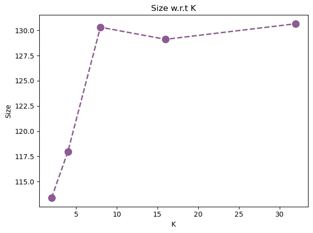

# Image Compression with K-Means

This assignment explores image compression using the **K-Means clustering algorithm**. The goal is to reduce the color space of an image by clustering similar colors and representing each pixel by the nearest centroid, compressing the image with minimal visual quality loss.

## Objective

To implement a basic image compression technique using the K-Means algorithm and observe its effects on both image quality and file size as the number of clusters (K) varies.

## Tools and Libraries

The assignment was completed using the following Python libraries:

- `matplotlib`
- `numpy`
- `PIL (Pillow)`
- `sklearn.cluster.KMeans`
- `os`

All code was written and executed in a Jupyter Notebook.
To install all required packages, run the following command in your terminal:
```bash
pip install -r requirements.txt
```

## Methodology

1. **Image Preprocessing**:
   - The input image was loaded and displayed.
   - The image data was reshaped from `(Height, Width, 3)` to `(Height × Width, 3)` for clustering.

2. **Color Space Visualization**:
   - The RGB distribution of pixels was visualized using a 3D scatter plot.

3. **K-Means Clustering**:
   - K-Means was applied for a range of `k` values (number of clusters).
   - Each pixel was reassigned to the nearest color centroid.

4. **Image Compression and Evaluation**:
   - Compressed images were generated and saved.
   - The file sizes of these compressed images were measured and compared.

## Results

### Compressed Images by K

Images were compressed using the following cluster counts:

`k = 2, 4, 8, 16, 32`


### File Size Comparison


## Conclusion

K-Means clustering is a simple method for image compression by reducing the number of unique colors. The trade-off between compression(image size) and visual quality is obvious:

- Low `k` values → high compression, low quality
- High `k` values → low compression, high quality

